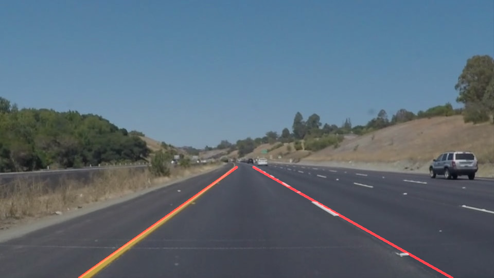
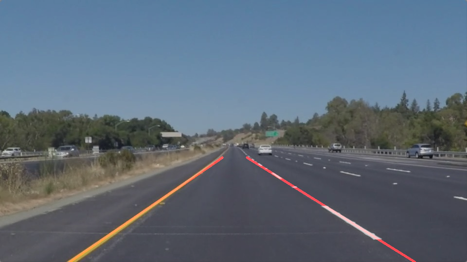
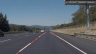
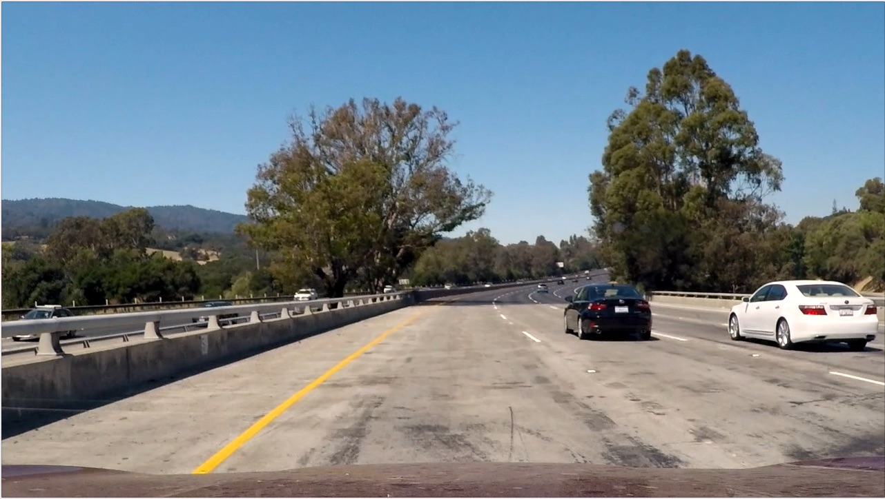

# **Finding Lane Lines on the Road** 


## Table of Contents

* [Introduction](#introduction)
* [Image Processing Pipeline](#image-processing-pipeline)
  * [Procedure](#procedure)
  * [Parameters](#parameters)
* [Draw\_lines()](#draw_lines)
  * [Heuristics for classifying line segments to left lane and right lane](#heuristics-for-classifying-line-segments-to-left-lane-and-right-lane)
  * [Line generation using weighted linear fit](#line-generation-using-weighted-linear-fit)
  * [Diagnostic information in debug mode](#diagnostic-information-in-debug-mode)
* [Notes on generating grayscale images using HSV](#notes-on-generating-grayscale-images-using-hsv)
* [Discussions on shortcomings and possible improvements](#discussions-on-shortcomings-and-possible-improvements)
  * [Better conversion color image into grayscale](#better-conversion-color-image-into-grayscale)
  * [More adaptively setting model parameters](#more-adaptively-setting-model-parameters)
  * [Lane\-detection\-specific Canny and Hough algorithms](#lane-detection-specific-canny-and-hough-algorithms)
  * [Persistence of previously detected lanes](#persistence-of-previously-detected-lanes)
  

## Introduction

The goals of this project are the following:
* Make a pipeline that finds lane lines on the road in still images and videos
* Reflect on your work in a written report

Here is a summary of the key folders and files in this project

* This README file is the project writeup, the original README from udacity is [README_udacity.md)](README_udacity.md)
* [P1.ipynb](P1.ipynb) is Jupyter notebook holding all the code used in this project
* [test_images](test_images) and [test_videos](test_videos) hold the input images and videos provided by Udacity
* [test_images_output](test_videos_output) and [test_videos_output](test_videos_output) hold the labeled images and videos produced by the [P1.ipynb](P1.ipynb)
* [test_images_output_DEBUG](test_videos_output_DEBUG) and [test_videos_output_DEBUG](test_videos_output_DEBUG) 
hold the labeled images and videos produced by the [P1.ipynb](P1.ipynb) in debug mode
* [create_gif.py](create_gif.py) creates the gif used in this report
  


Before diving into the details, here is a quick overview of the final results

**Images**: (All labeled images are in [test_images_output](test_images_output))

  
  

**Videos:** (All labeled videos are in [test_videos_output](test_videos_output))

  


## Image Processing Pipeline

### Procedure

The image processing pipeline consists of the following steps:

  1. Covert color image to grayscale: 
  
        ```python
        img_gray = grayscale(image)
        ```
  
  2. Smooth image to suppress noise and spurious gradients in preparation of Canny edge detection: 
    
        ```python
        img_blur = gaussian_blur(img_gray, params.kernel_size)
        ```
  
  3. Canny edge detection:
  
        ```python
        img_canny = canny(img_blur, params.low_threshold, params.high_threshold)
        ```
  
  4. Define region of interest (ROI) 
        
        ```python
        masked_canny = region_of_interest(img_canny, vertices)
        ```
    
  5. Use Hough transform to detect lines within ROI
        
        ```python
        line_img = hough_lines(masked_canny, 
                               params.rho, params.theta, params.threshold, 
                               params.min_line_len, params.max_line_gap)
        ```
  
  6. Overlay detected lines on image
  
        ```python 
        result  = weighted_img(line_img, image)
        ```

### Parameters

A set of parameters are defined for Gaussian blur, Canney edge detection, and Hough transform

```python

class piplineParameters():
    def __init__(self):
        self.kernel_size=11 # for gaussian blur
        self.low_threshold = 30
        self.high_threshold = 100 # for canny edge detection
        # hough transformation parameters
        self.rho = 2 # distance resolution in pixels of the Hough grid
        self.theta = np.pi/180 # angular resolution in radians of the Hough grid
        self.threshold = 20 # minimum number of votes (intersections in Hough grid cell)
        self.min_line_len = 40 #minimum number of pixels making up a line
        self.max_line_gap = 40 # maximum gap in pixels between connectable line segments)

```

In addition, the ROI is defined as follows, where ```imshape[0]``` and ```imshape[1]``` are the Y and X size of the image

```python

vertices = np.array([[(0,imshape[0]),
                    (imshape[1]*0.48, imshape[0]*0.6), 
                    (imshape[1]*0.52, imshape[0]*0.6), 
                    (imshape[1],imshape[0])]], dtype=np.int32)

```

## Draw_lines()

The function draw_lines() is modified to achieve the following:

  1. Determine if a certain line segment returned by Hough transform belongs to the left lane or the right lane, 
  or it does not belong to either lane and should be rejected

  2. Based on the accepted line segments, generate and draw one line for the left lane and the right lane respectively
  
  3. In debug mode (controlled by flag ```DEBUG```), output diagnostic information about accepted left /right lane line segments, 
  rejected line segments and overall confidence in final lane lines.


### Heuristics for classifying line segments to left lane and right lane
For item 1, the heuristics implemented are:

  * Left lane line segments should have slope s < 0 and right lane line segments should have slope s > 0, where s = (y2-y1) / (x2-x1)
  This heuristic is further narrowed down to 
      ```math
      left lane: -5 < s < -0.4
      right lane: 5 > s > 0.4
      ```
  * Sometimes a line segment appears on the left half of the screen but has a slope that satisfies the right lane condition, 
  this can be detected and rejected by checking if the end points of the line are on the correct half of the screen
    ```math
    left lane: x1 < mid_x*1.1 and x2 < mid_x*1.1
    right lane: x1 > mid_x*0.9 and x2 > mid_x*0.9
    ```
    where mid_x is half of the image size in X direction.
  
  * Additionally, we can also check the x interception point at the bottom of the screen to make sure it falls in the right range
    ```python
    s = float((y2-y1)/(x2-x1))  # slope                        
    b = float(y1*x2 - y2*x1) / (x2-x1)  # interscept as in y=s*x+b
    if s !=0:
        x_intercept = (img.shape[0]-b)/s
    else:
        x_intercept = np.inf
    ```
    The heuristic is
    ```math
    left alne: 0.0 < x_intercept/max_x < 0.5
    right lane: 0.5 < x_intercept/max_x < 1.0
    ```
    where max_x is the size of the image along the x direction.
    
### Line generation using weighted linear fit

After the line segments are properly classified, the overall lane lines are generated using weighted linear fit of all 
accepted points belonging to that lane. The points are weighted according to the original length (in fact length squared) 
of the line segments. Longer line segments have large weights.


### Diagnostic information in debug mode

Diagnostic information is helpful in seeing what is happening under the hood and in providing insights for tuning parameters 
especially when working on the more challenging cases.

Here is an example video output in debug mode for challenge.mp4: [challenge_DEBUG.mp4](test_videos_output_DEBUG/challenge.mp4)

A frame from the video


In debug mode, the draw_lines() function provides the following diagnostic information:

  * line segments classified into right lane are marked blue
  * line segments classified into left lane are marked green
  * Rejected line segments are marked magenta
  * Final lane lines are marked red
  * When goodness-of-fit (GOF) falls below 0.7, print out relevant message in terminal

We can see that, in addition to correctly classifying of line segments into the left lane and the right lane, 
the program is also very effective in rejecting a lot of spurious line segments caused by the hood of the car, 
shadows from the tree on the side of the road, skid marks on the road and road color changes.


## Notes on generating grayscale images using HSV

In working on images with yellow lanes and especially in working with challenge.mp4, I noticed that direct conversion from RGB to 
grayscale would yield very weak contrast between yellow color lane marking and light gray color road surface.

One thing I did to alleviate this is to use the V channel (brightness) in HSV color space as the "grayscale" image instead of 
actual grayscale image generated by ```cv2.cvtColor(img, cv2.COLOR_RGB2GRAY)```

Here is a frame from challenge.mp4, with a yellow lane on the left and light gray road surface.



First we use the grayscale image generated by ```cv2.cvtColor(img, cv2.COLOR_RGB2GRAY)```


As we can see, even though the yellow lane is fairly visible in the RGB image, once converted into grayscale it lost its 
contrast to the road surface. Consequently, the Canny edge detection and Hough transform missed it.

On the other hand, if we use the V channel of HSV color space we get the following much higher contrast grayscale image 
and lane lines are properly generated, as shown below.


## Discussions on shortcomings and possible improvements

In this section, I will discuss the possible improvements, all of which tie to shortcomings of the current implementation of the program.

### Better conversion color image into grayscale

As discussed in [Notes on generating grayscale images using HSV](#notes-on-generating-grayscale-images-using-hsv), 
even though the yellow lane marking is very visible to human eyes, when converted to a grayscale image, it lost its contrast. 
My solution was using the V channel of the HSV color space of the image. However, I suspect there are better ways. 

Given the goal is to specifically enhance lane marking visibility and lane markings are usually white or yellow. 
We can perhaps selectively boost these colors. This would make all the downstream processing more robust.

### More adaptively setting model parameters

Currently, all model parameters are hand-crafted and hard-coded. A one-size-fits-all set of parameters would have to incur 
some compromises under different road conditions and camera configurations. 
It would be better to let the program determine the best ROI, and parameters for smoothing, edge detection and line detection, 
given certain image characteristics. This would allow optimized performance under all conditions.
 
### Lane-detection-specific Canny and Hough algorithms

In lane detection, we have the prior knowledge that lanes are roughly pointing forward, the lane markings are lines with certain typical width, 
and as lanes go forward if it uses segmented lane marking, each segment becomes shorter. If we could use this knowledge, we could implement 
application specific Canny edge detection and Hough line detection algorithms. 

For example, we could preferentially detect edges gradient around our typical lane angles. In Hough transformation, 
we could require that a line has to be double lines that are close to each other (two edges of a lane marking). 
Within different portions of the image, we could use different sets of Hough parameters. For example, in the middle
of the image where lanes almost meet the horizon, we allow shorter lines to be detected compared to the bottom of the images, 
where lanes are closer to us.

### Persistence of previously detected lanes
 
For lane detection in the challenge.mp4, there are still a few frames near t = 4s, where the right lane lacks line segments and 
right lane line was not generated successfully. In addition, in most of the videos, the lanes are jittery (rapidly making random 
small adjustments back and forth). 
These are because the program currently only considers the present moment, without retaining any history of detected lanes in 
previous frames.

Because we know that lanes change gradually in reality, so the current and successive frames should yield lanes with small and gradual adjustments from the 
previous frame. This would allow us to 
(1) more easily reject irrelevant line segments based on previously detected lane lines
(2) have estimated lane lines even if current frame lacks good features to generate them 
(3) provide smooth lane guidance without unnecessary jitter.
